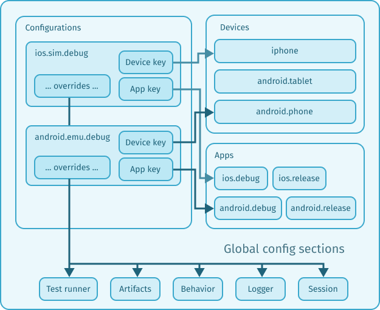

# Overview

:::info

If you prefer to read TypeScript files instead of docs, feel free to browse through
[the typings file](https://github.com/wix/Detox/blob/master/detox/index.d.ts) provided by Detox.

:::

Running automated tests on your mobile application implies firstly that
you have a mobile device and an application. Unlike unit tests, where
passing tests don’t require extra checks, the end-to-end tests are better
to be executed multiple times – on various devices and app flavors (e.g.
_debug_ and _release_).

This is why Detox is inclined towards static configuration files describing
permutations of _apps_, _devices_ and a lot more, actually. If you come to
think of it, even a simple React Native application is likely to have four
combinations:

1. iOS simulator running a _debug_ build;
1. iOS simulator running a _release_ build;
1. Android emulator running a _debug_ build;
1. Android emulator running a _release_ build;

Imagine you want to check your app both on phones and tablets, and now you
have eight combinations already! Add multiple OS versions into the test
coverage matrix equation, and the configuration grows by a factor of N.

## Config structure

In view of the arguments above, our recommendation to keep Detox configs
neat and tidy is to keep them inside three key-value dictionaries:
`devices`, `apps` and `configurations`. See the schematic code below:

```javascript
/* @type {Detox.DetoxConfig} */
module.exports = {
// highlight-next-line
  devices: {
    device1: { /* ... */  },
    device2: { /* ... */  },
  },
// highlight-next-line
  apps: {
    app1: { /* ... */  },
    app2: { /* ... */  },
  },
// highlight-next-line
  configurations: {
    'device1+app1': {
      device: 'device1',
      app: 'app1',
    },
    /* ... */
  },
};
```

Configuration names serve as an entry point, when you want to run Detox tests:

```bash
detox test -c 'device1+app1'
```

When Detox starts, it picks the specified configuration and resolves its aliases to the device and
the application. However, the config file is not limited only to devices and applications – there
are more sections:

```javascript
/* @type {Detox.DetoxConfig} */
module.exports = {
// highlight-start
  artifacts: { /* ... */ },
  behavior: { /* ... */ },
  logger: { /* ... */ },
  session: { /* ... */ },
  testRunner: { /* ... */ },
// highlight-end
  devices: { /* ... */ },
  apps: { /* ... */ },
  configurations: { /* ... */ },
};
```

When the config gets finally resolved, it looks more like a flat structure, as shown on the diagram:


Aside from mandatory `device` and `app` properties, each configuration can have
overrides to the global config sections such as `testRunner`, `artifacts`,
`behavior` and others, e.g.:

```javascript
/* @type {Detox.DetoxConfig} */
module.exports = {
  logger: {
// highlight-next-line
    level: process.env.CI ? 'debug' : 'info',
  },
  /* ... */
  configurations: {
    'ios.sim.debug': {
      device: 'iphone',
      app: 'ios.debug',
// highlight-start
      testRunner: {
        args: {
          runInBand: true,
        },
      },
// highlight-end
      // ...
// highlight-start
      logger: {
        level: 'trace' // override
      },
// highlight-end
    },
  },
};
```

For more clarity, this relationship might be illustrated with a diagram:



It should be noted that the aliasing of devices and apps is optional in fact.
Instead of using keys, you can inline both device and app configs into your
configuration, e.g.:

```javascript
/* @type {Detox.DetoxConfig} */
module.exports = {
  configurations: {
    'ios.sim.debug': {
      device: {
        type: 'ios.simulator',
        device: {
          type: 'iPhone 13 Pro',
        },
      },
      app: {
        type: 'ios.app',
        binaryPath: '/path/to/your.app',
      },
    },
  },
};
```

Besides, there is [basic support](apps.md) for tests with multiple applications, if you switch
to `apps` array (aliased or inlined) instead of `app`, e.g.:

```javascript
/* @type {Detox.DetoxConfig} */
module.exports = {
  apps: { /* ... */ },
  devices: { /* ... */ },
  configurations: {
    'multi.ios.debug': {
      device: 'iphone',
      apps: ['passenger.ios.debug', 'driver.ios.debug'],
    },
  },
};
```

## Path conventions

Detox supports standalone configuration files and the respective named section inside `package.json`.
It starts scanning from the current working directory, and runs over the following options, in this order:

1. `.detoxrc.js`
1. `.detoxrc.json`
1. `.detoxrc` (JSON)
1. `detox.config.js`
1. `detox.config.json`
1. `package.json`

If you decide to have `detox` section in your `package.json`, it should be defined as a top-level
property:

```json
{
  "name": "your-project",
  "version": "X.Y.Z",
  "scripts": {},
// highlight-start
  "detox": {
    "devices": {},
    "apps": {},
    "configurations": {},
  }
// highlight-end
}
```

## Extending

All Detox config files are extensible by definition.
That helps if you ever need to share certain settings across multiple mobile projects, e.g.:

```json
{
// highlight-next-line
  "extends": "@my-org/detox-preset",
  "configurations": {
    // …
  },
}
```

Please note that `extends` has to be a valid Node module path. Relative module paths will be resolved relatively
to the Detox config file which contains that specific `extends` property, e.g.:

```js title="~/Projects/my-project/e2e/detox.config.js"
module.exports = { extends: "../base.detox.config.js" };
// the path resolves to: ~/Projects/my-project/base.detox.config.js

module.exports = { extends: "./ci.detox.config.js" };
// the path resolves to: ~/Projects/my-project/e2e/ci.detox.config.js
```

The extension chain can have an arbitrary length. All the configs are going to be _deep-merged_ in the logical
order: grandparent ← parent ← child.

## Default configuration

As you might have noticed, you always have to pass `-c <configuration name>` argument when running Detox tests:

```bash
detox test -c ios.sim.debug
```

Technically this is not true. You can omit the configuration name if:

- there is only one configuration in `configurations` dictionary;
- you set some configuration as a default choice via `selectedConfiguration` property:

  ```javascript
  /* @type {Detox.DetoxConfig} */
  module.exports = {
  // highlight-next-line
    selectedConfiguration: 'device1+app1',
    devices: {
      device1: { /* ... */  },
      device2: { /* ... */  },
    },
    apps: {
      app1: { /* ... */  },
      app2: { /* ... */  },
    },
    configurations: {
  // highlight-next-line
      'device1+app1': {
        device: 'device1',
        app: 'app1',
      },
      /* ... */
    },
  };
  ```

The next articles will be describing each configuration section in detail.
